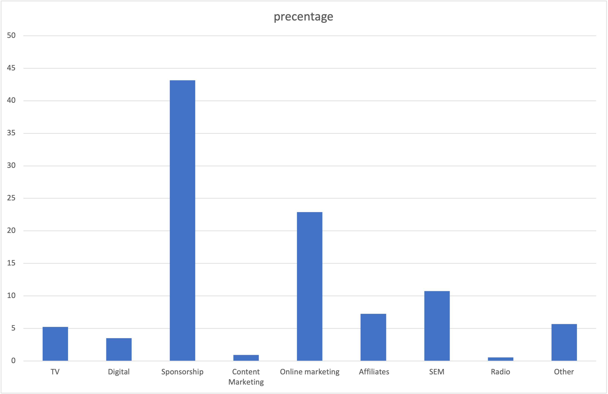

# Marketing Spend Analysis

## Overview
This project analyzes multi-channel marketing spend data to understand how marketing budgets are allocated across different channels and to ensure consistency between reported total investment and channel-level spend.

The analysis emphasizes data validation, reconciliation, and structured comparison of budget allocation to generate actionable insights into marketing strategy and channel prioritization.

---

## Business Questions
- How is marketing budget distributed across different channels?
- Is the reported total investment consistent with the sum of channel-level spend?
- What do discrepancies reveal about data quality and budget reporting practices?
- What does the budget allocation suggest about the company’s marketing strategy?

---

## Data Source
- Dataset: Marketing Spend Dataset (Kaggle)
- Time period: 2015–2016
- Granularity: Monthly marketing investment by channel
- Channels include: TV, Digital, Sponsorship, Content Marketing, Online Marketing, Affiliates, SEM, Radio, and Others

---

## Data Validation & Quality Checks
Before conducting any analysis, the dataset was validated to ensure consistency between reported total investment and channel-level spend.

### Validation Process
- Calculated the sum of channel-level spend for each month
- Compared channel-level sums with reported total investment
- Identified and classified discrepancies using tolerance-based logic

### Discrepancy Classification
- **Rounding Difference**: Minor numerical differences caused by rounding or floating-point precision
- **Unallocated Value**: Larger differences potentially caused by missing or undistributed budget categories

### Key Findings from Validation
- The majority of monthly records showed only rounding-related discrepancies
- A small number of months exhibited evidence of unallocated marketing spend

To ensure analytical accuracy, subsequent analysis focuses only on months where discrepancies were attributable to rounding differences.

---

## Analysis Scope
- Channel-level marketing budget allocation
- Relative contribution of each channel to total marketing spend
- Comparison between brand-focused and performance-driven marketing channels

Months with unallocated budget values were excluded from downstream analysis to avoid distorted conclusions.

---

## Budget Allocation Comparison
Using the validated dataset, channel-level spend was aggregated to compare how marketing resources were distributed across different channels.

This comparison provides insight into overall marketing priorities, highlighting the balance between long-term brand-building initiatives and performance-oriented acquisition strategies.

---

## Visualization

### Channel Budget Allocation
The chart below illustrates the distribution of total marketing spend across channels after data validation.

---

## Key Insights
- Sponsorship represents the largest share of total marketing spend, indicating a strong emphasis on brand-building activities.
- Online marketing and SEM together account for a significant portion of the budget, reflecting continued investment in performance-driven channels.
- The overall allocation suggests a strategic balance between brand exposure and measurable acquisition efforts.

